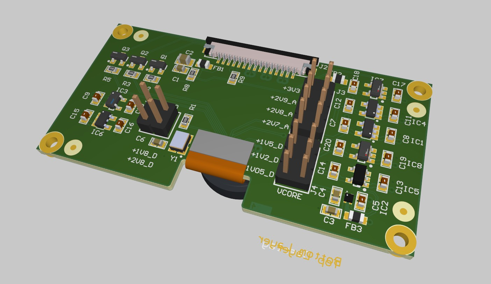

# CAMEMAKE – Universal MIPI CSI-2 Camera Adapter for Jetson

**CAMEMAKE** created an open-source hardware adapter board that connects MIPI CSI-2 camera modules directly to NVIDIA Jetson boards such as the Nano, TX2, and Xavier NX. Many factory camera modules lack a timing crystal and require multiple independent voltage rails — this board provides those, allowing seamless integration.

---

## 🔗 Altium Designer Project

View the full schematic and 3D layout online:

**[🧭 View in Altium 365](https://365.altium.com/files/9A22F9D0-325F-4AF5-839A-7F1FEFB84FBE?variant=[No+Variations])**

---

## 🧰 Key Features

- Plug-and-play for Jetson platforms with standard 2-lane MIPI interface
- Provides missing 24 MHz MCLK via onboard crystal oscillator
- Independent power rails: VDDIO, AVDD, VCORE, etc.
- Supports wide variety of factory camera modules
- Simple jumper/pin header voltage configuration
- Board-to-board camera output, FPC Jetson input

---

## 🔌 Connector Overview

### ▶️ Input: From Host Platform (Jetson)

15-pin board-to-board or FPC connector (e.g., Hirose DF40):

| Pin | Function        |
|-----|-----------------|
| 1   | GND             |
| 2   | +3.3V_EXT       |
| 3   | D0_N            |
| 4   | D0_P            |
| 5   | D1_N            |
| 6   | D1_P            |
| 7   | CLK_N           |
| 8   | CLK_P           |
| 9   | CAM_PWDN        |
| 10  | CAM_MCLK        |
| 11  | CAM_SCL_3V3     |
| 12  | CAM_SDA_3V3     |
| 13  | GND             |
| 14  | GND             |
| 15  | GND             |

### ◀️ Output: To Camera Module (30-pin FPC)

Supports 2 or 4 MIPI lanes, power rails, I2C, MCLK:

| Pin | Function      | Pin | Function      |
|-----|---------------|-----|---------------|
| 1   | GND           | 2   | GND           |
| 3   | DVDDIO_0.5V   | 4   | DVDD_1.8V     |
| 5   | GPO           | 6   | AGND          |
| 7   | AVDD2_8V      | 8   | DGND          |
| 9   | I2C_SDA       | 10  | I2C_SCL       |
| 11  | STROBE        | 12  | PWDN1         |
| 13  | GND           | 14  | MCLK (24 MHz) |
| 15  | GND           | 16  | GND           |
| 17  | DP3 (MIPI)    | 18  | DN3 (MIPI)    |
| 19  | DP2           | 20  | DN2           |
| 21  | GND           | 22  | DP1           |
| 23  | DN1           | 24  | GND           |
| 25  | CLKP          | 26  | CLKN          |
| 27  | GND           | 28  | DPG           |
| 29  | DNG           | 30  | GND           |

MIPI signal traces controlled for **100Ω ±10Ω differential impedance**.

---

## ⚡ Power Rails

CAMEMAKE provides the following regulated outputs:

| Rail     | Use Case                       |
|----------|--------------------------------|
| VDDIO    | I/O voltage (1.8, 2.8)   |
| AVDD     | Analog supply (2.7, 2.8, 2.8, 3.3)      |
| DVDD     | Digital core voltage (1.05, 1.5, 1.8) |

Voltage selection is done through jumpers or onboard LDO regulators (see the sensor datasheet for the required voltage of the sensor).

---
**Made with ❤️ by the CAMEMAKE Team**

