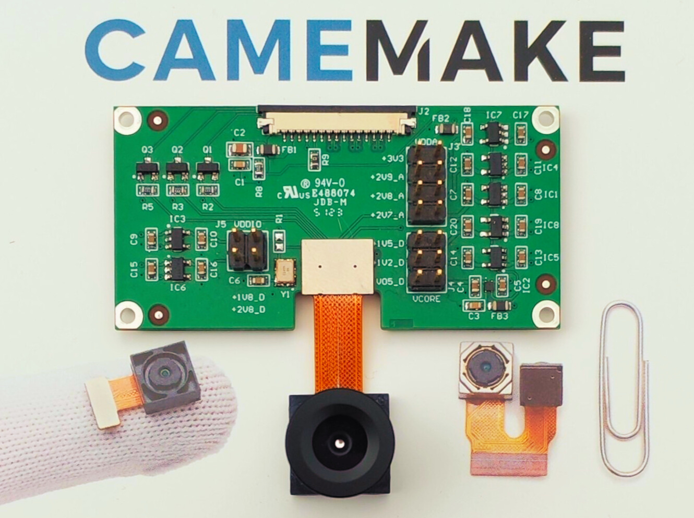

# CAMEMAKE – Universal MIPI CSI-2 Camera Adapter for Nvidia Jetson or any other development kit with the same CSI pinout

**CAMEMAKE** created an open hardware interface board designed to simplify connection between bare factory camera modules and NVIDIA Jetson platforms (Jetson Nano, TX2, Xavier NX, etc.) with a **2-lane MIPI CSI interface**.

This adapter brings everything your camera module typically lacks:
- A precise **timing crystal**
- Proper **voltage regulation** for all sensor domains
- Industry-standard **FPC input** and **board-to-board output**

---

## 📸 Why CAMEMAKE?

A camera modules standard comes without:
- A 24MHz crystal for MCLK
- Require multiple, specific voltage rails
- Don’t use a standard FPC connector format
- Can’t be directly used with Jetson boards or any other with the same pinout without custom hardware

CAMEMAKE solves these issues in a compact, drop-in solution.

---

## 🔌 Hardware Overview

### ▶️ Input: 30-pin FPC Connector (from Jetson or compatible carrier)

Supports **MIPI CSI-2 (1, 2 or 4 lane)** with I²C, GPIO, and multiple power domains:

| Pin | Function      | Pin | Function      |
|-----|---------------|-----|---------------|
| 1   | GND           | 2   | GND           |
| 3   | DVDDIO_0.5V   | 4   | DVDD_1.8V     |
| 5   | GPO           | 6   | AGND          |
| 7   | AVDD2_8V      | 8   | DGND          |
| 9   | I2C_SDA       | 10  | I2C_SCL       |
| 11  | STROBE        | 12  | PWDN1         |
| 13  | GND           | 14  | MCLK (24 MHz) |
| 15  | GND           | 16  | GND           |
| 17  | DP3 (MIPI)    | 18  | DN3 (MIPI)    |
| 19  | DP2           | 20  | DN2           |
| 21  | GND           | 22  | DP1           |
| 23  | DN1           | 24  | GND           |
| 25  | CLKP          | 26  | CLKN          |
| 27  | GND           | 28  | DPG           |
| 29  | DNG           | 30  | GND           |

---

### ◀️ Output: Board-to-Board Connector (to Camera Module)

- Compatible with multiple compact camera modules
- Provides:
  - 24 MHz MCLK
  - Multiple configurable voltage domains:
    - `VDDIO` (e.g., 1.8V)
    - `AVDD` (e.g., 2.8V)
    - `VCORE` (e.g., 1.2V)
    - `DVDD`, `AFVDD` (as needed)
  - I2C control
  - MIPI CSI-2

Each power rail is independently regulated and labeled. Check your sensor’s datasheet and match voltages using the board’s jumpers or designated headers.

---

## 🛠 Schematics & Layout

Design files are provided in **Altium Designer format**. View online:

https://365.altium.com/files/9A22F9D0-325F-4AF5-839A-7F1FEFB84FBE?variant=[No+Variations]

